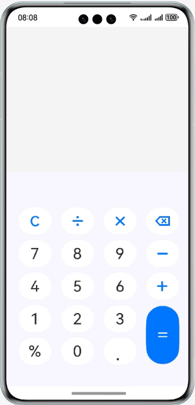

# 实现简易计算器

### 简介

基于基础组件、容器组件，实现一个支持加减乘除混合运算的计算器。效果如图所示：

### 相关概念

- ForEach组件：ForEach基于数组类型数据执行循环渲染。
- TextInput组件：单行文本输入框组件。
- Image组件：Image为图片组件，常用于在应用中显示图片。Image支持加载string、PixelMap和Resource类型的数据源，支持png、jpg、bmp、svg和gif类型的图片格式。

### 相关权限

不涉及

### 使用说明

1. 在键盘输入区域输入表达式。
2. 表达式输入框实时显示键盘输入区域输入的表达式。
3. 结果输出框实时显示表达式的计算结果。

### 约束与限制

1. 本示例仅支持标准系统上运行，支持设备：华为手机。
2. HarmonyOS系统：HarmonyOS 6.0.0 Release及以上。
3. DevEco Studio版本：DevEco Studio 6.0.0 Release及以上。
4. HarmonyOS SDK版本：HarmonyOS 6.0.0 Release SDK及以上。
